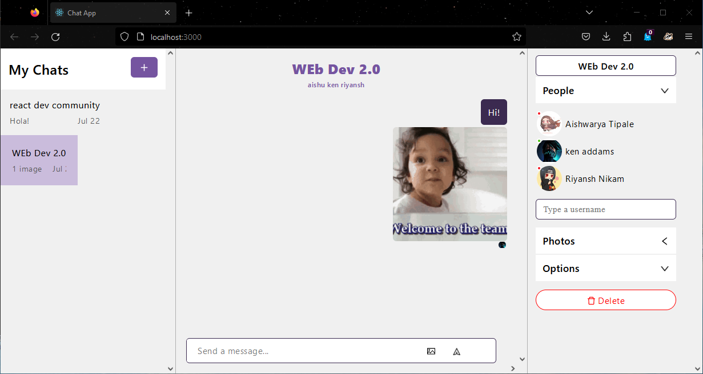

# chat-app


# Real-time Chat App in React.js with ChatEngine 💬🚀

This project is a real-time chat application built using React.js and ChatEngine. The app enables users to communicate seamlessly in real-time, providing a user-friendly and efficient messaging experience. Axios is utilized for API communication with the ChatEngine backend.

## Key Features 🔑📝

- Real-time messaging using React.js and ChatEngine.
- User authentication and login/logout functionality.
- User-friendly interface for sending and receiving messages in real-time.
- Axios integration for making HTTP requests to the ChatEngine API.
- Additional features like user avatars, group chats, and private messaging.
- Stylish UI/UX design for an appealing user experience.

## Getting Started 🚀🏁

1. Clone the repository:

```bash
git clone https://github.com/yourusername/real-time-chat-app.git
cd real-time-chat-app
```

2. Install dependencies:

```bash
npm install
```

3. Sign up for a ChatEngine account at [https://chatengine.io/](https://chatengine.io/) and create a new project. Note down the `Project ID` and `API Key`.

4. Replace `YOUR_PROJECT_ID` and `YOUR_USERNAME` in `ChatApp.js` with your ChatEngine project ID and desired username.

5. Run the app:

```bash
npm start
```

The app will be available at [http://localhost:3000](http://localhost:3000).

## Future Improvements 🚧🔮

- Implement message history and scroll-to-bottom functionality.
- Enhance user profiles with more information.
- Add support for file attachments and media sharing.

## Contributing 🤝❤️

Contributions are welcome! If you find any issues or want to add new features, feel free to submit a pull request.

## License 📄📜

This project is licensed under the [MIT License](LICENSE).

## Acknowledgments 🙏🎉


---




